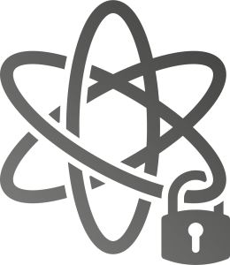

+++
date = "2015-12-2T14:10:00+03:00"
draft = false
title = "Bring your own HSM solution or use our BareMetalHSM."
weight = 4
+++

&nbsp;<i class="fas fa-plug"></i>&nbsp; safeSig <.io> KeyGuardAPI integrates with our BareMetalHSM, _Azure Key Vault, AWS CloudHSM or your custom solution_.

</i> safeSig <.io> BareMetalHSM service provides dedicated FIPS 140-2 Level 3 Validated hardware.

</i> Hosted in a SAS70 certified Tier 4 Data Center with 24-hour security and biometric restricted access.

</i> safeSig <.io> BareMetalHSM is the only cloud HSM that quickly and easily supports BIP32 key management.
